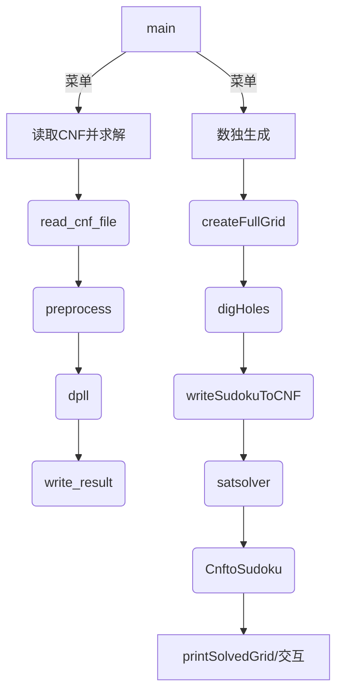

# 任务书

## 设计内容
SAT 问题即命题逻辑公式的可满足性问题（satisfiability problem），是计算机科学与人工智能基本问题，是一个典型的 NP 完全问题，可广泛应用于许多实际问题如硬件设计、安全协议验证等，具有重要理论意义与应用价值。本设计要求基于 DPLL 算法实现一个完备 SAT 求解器，对输入的 CNF 范式算例文件，解析并建立其内部表示；精心设计问题中变元、文字、子句、公式等有效的物理存储结构以及一定的分支变元处理策略，使求解器具有优化的执行性能；对一定规模的算例能有效求解，输出与文件保存求解结果，统计求解时间。

## 设计要求
- 输入输出功能（15%）：程序执行参数输入，CNF 文件读取，结果输出与保存。
- 公式解析与验证（15%）：建立内部表示，并能逐行打印验证解析正确性。
- DPLL 过程（35%）：基于 DPLL 框架实现 SAT 求解。
- 时间性能测量（5%）：记录 DPLL 执行时间（毫秒）。
- 程序优化（15%）：在数据结构或分支策略等方面优化，并给出优化率 [(t-to)/t]*100%。
- SAT 应用（15%）：将数独问题归约为 SAT，集成求解并具备简单交互。

## 参考文献
[1] 张健著. 逻辑公式的可满足性判定—方法、工具及应用. 科学出版社，2000  
[2] Tanbir Ahmed. An Implementation of the DPLL Algorithm. Concordia University, 2009  
[3] 陈稳. 基于 DPLL 的 SAT 算法的研究与应用. 电子科技大学, 2011  
[4] Carsten Sinz. Visualizing SAT Instances and Runs of the DPLL Algorithm. JAR (2007) 39:219–243  
[5] 360百科：数独游戏 https://baike.so.com/doc/3390505-3569059.html  
Twodoku：https://en.grandgames.net/multisudoku/twodoku  
[6] Tjark Weber. A SAT-based Sudoku Solver. LPAR 2005.  
[7] Inês Lynce, Joel Ouaknine. Sudoku as a SAT Problem. AIMATH 2006.  
[8] Uwe Pfeiffer et al. A Sudoku-Solver for Large Puzzles using SAT. EPiC 13.  
[9] Sudoku Puzzles Generating: from Easy to Evil. http://zhangroup.aporc.org/images/files/Paper_3485.pdf  
[10] 薛源海等. 基于“挖洞”思想的数独游戏生成算法. 数学的实践与认识, 2009  
[11] 黄祖贤. 数独游戏的问题生成及求解算法优化. 安徽工业大学学报, 2015

---

# 目录
- 任务书  
- 1 引言  
  - 1.1 课题背景与意义  
  - 1.2 国内外研究现状  
  - 1.3 课程设计的主要研究工作  
- 2 系统需求分析与总体设计  
  - 2.1 系统需求分析  
  - 2.2 系统总体设计  
- 3 系统详细设计  
  - 3.1 数据结构的定义与关系  
  - 3.2 DPLL 算法设计与推导  
  - 3.3 分支启发式与复杂度分析  
  - 3.4 数独生成与归约设计  
- 4 系统实现与测试  
  - 4.1 实现环境与工程结构  
  - 4.2 核心接口与调用关系  
  - 4.3 测试方案与用例设计  
  - 4.4 性能评测与优化率  
- 5 总结与展望  
  - 5.1 全文总结  
  - 5.2 工作展望  
- 6 体会  
- 参考文献  
- 附录：样例、截图与脚本

---

# 1 引言

## 1.1 课题背景与意义
SAT（Satisfiability）问题是判定给定命题公式是否存在使其为真的赋值的判定问题。自 Cook-Levin 定理表明经典 NP 完全性以来，SAT 被广泛作为诸多组合优化与验证问题的统一建模平台。与传统的“为具体问题手写算法”相比，SAT 的优势在于：
- 统一性：多样问题→CNF 编码→标准求解器；
- 复用性：改进一个求解器即可普惠多个领域；
- 工程可行性：现代 SAT 求解器已经能处理上亿文字级别的实例。

本项目面向教学与实践，目标是从零实现一个可用的 DPLL 求解器，覆盖 CNF 解析、内部结构、DPLL 核心流程、分支启发式与性能度量，并将数独问题完整地归约到 SAT 进行求解，构成“理论-实现-应用”的闭环。

## 1.2 国内外研究现状
工业级 CDCL 求解器（MiniSAT、Glucose、Kissat、Maple 系列、CaDiCaL 等）大量采用冲突分析（1-UIP 学习）、双 watched literals、LBD/活动度、重启策略等，已形成成熟工程体系。学术界持续探索更好的启发式、学习子句管理、并行化与领域特定编码。本课程项目则聚焦 DPLL 基础版本，兼顾可读性与可验证性。

## 1.3 课程设计的主要研究工作
- 实现 DIMACS CNF 解析与内部结构；
- 设计出现表与变更栈，支持高效传播与撤销；
- 实现 DPLL：单子句传播、回溯、分支策略；
- 设计两种分支策略并对比耗时，输出优化率；
- 实现数独生成、挖洞保唯一、CNF 归约与解还原；
- 提供控制台交互与结果落盘。

---

# 2 系统需求分析与总体设计

## 2.1 系统需求分析
功能性需求：
- 读取 CNF：支持 c 注释、p 头行、子句行；
- 解析验证：可选择打印 CNF 以用于人工对照；
- SAT 求解：基于 DPLL，支持两种分支策略；
- 时间统计：返回并打印耗时，写入 .res；
- 结果保存：生成 `.res`（s/v/t）；
- 数独应用：生成题面、归约 CNF、调用求解、解还原、交互编辑；
- 菜单交互：生成数独/求解 CNF/展示结果/交互模式。

非功能性需求：
- 正确性：解析、传播、回溯需可验证；
- 可维护：结构清晰、内存管理完备；
- 复用性：SAT 与数独模块相互独立；
- 性能：在教学规模算例上流畅运行。

## 2.2 系统总体设计
模块划分：
- I/O 模块（main + 工具函数）
- 解析模块（read_cnf_file + print_cnf）
- DPLL 模块（preprocess/assign/unassign/dpll/branching）
- 计时与输出模块（satsolver + write_result）
- 数独模块（生成/挖洞/归约/还原/交互）



---

# 3 系统详细设计

## 3.1 数据结构的定义与关系
核心结构（节选自 `definition.h`）：
- Clause：literals、assignment_status、original_length、current_length、is_satisfied、unit_literal；
- LiteralOccurrence/OccurrenceList：记录文字在各子句中的出现位置；
- ChangeRecord：撤销栈元素，-1 表示“整子句满足”，非 -1 表示“某文字位置被标记 ASSIGNED”；
- VariableResult：记录变量当前赋值（TRUE/FALSE/UNASSIGNED）；
- 全局状态：
  - unit_clause_stack + unit_stack_size；
  - change_stack + change_stack_top；
  - change_counts[depth][SATISFIED/SHRUNK]；
  - pos_literals/neg_literals；in_unit_pos/in_unit_neg；
  - current_formula_length；depth、contradiction_found、conflicting_literal。

关系示意：
```
Formula
 ├─ Clause[0..m-1]
 │   ├─ literals[0..len-1]
 │   ├─ assignment_status[0..len-1]
 │   ├─ original_length/current_length
 │   └─ is_satisfied / unit_literal
 ├─ pos_literals[var] : OccurrenceList
 └─ neg_literals[var] : OccurrenceList

Stacks
 ├─ unit_clause_stack
 └─ change_stack (with change_counts by depth)
```

设计要点：
- 出现表允许 O(出现次数) 更新，避免在整式上全扫描；
- change_counts 按层统计，可 O(变更数) 精确撤回；
- unit_literal 缓存便于在撤销时清理 in_unit_pos/neg 标记。

## 3.2 DPLL 算法设计与推导
- 单子句预处理：读取完成后将所有一元子句入栈；
- 传播 assign_value(lit)：
  - 满足 lit 所在子句：current_formula_length--，压入 {c,-1}；
  - 删除 ~lit 在子句中的可行性：assignment_status[pos]=ASSIGNED、current_length--，压入 {c,pos}；
  - 若跌至单子句：检测冲突（同变量相反极性同时入堆），否则压栈 unit_clause_stack；
- 回溯 unassign_value(lit)：
  - 先撤 SHRUNK，再撤 SATISFIED（严格 LIFO 且按层计数）；
- 终止条件：
  - 无子句未满足（current_formula_length==0）：SAT；
  - 矛盾：返回 UNSAT（由上一层回溯）；
- 分支：选择 branch_lit，先赋为真递归，再取反递归；均失败则 UNSAT。

正确性要点：
- 传播等价于合取范式在赋值下的语义化简；
- 回溯通过完整撤销本层所有变更，恢复到上一层的一致状态；
- 终止判定与 DIMACS 语义一致。

## 3.3 分支启发式与复杂度分析
- method=1：最小子句长度参与度评分（近似 MOMS）
  - 对每个未赋值变量 v：统计其正/负极性在“最短子句”中的出现计数 pc、nc；
  - 评分：score = (2*pc+1)*(2*nc+1)，并以 pc>=nc 决定极性；
  - 直觉：最大化命中的“最紧”约束，推动传播。
- method=2：首个未赋值变量（baseline）
  - 简单、对比参照。

复杂度讨论：
- 传播：基于出现表，消除与满足均按出现次数线性推进；
- 分支：扫描变量与出现表统计最短子句参与度，开销相对较小；
- 总体：指数级最坏复杂度，但策略显著影响平均性能。

## 3.4 数独生成与归约设计
- 生成：`createFullGridLasVegas` 随机预填 + 回溯求解；`createFullGrid` 设置 1 秒时间窗动态调整 preFilled；
- 挖洞：随机挖空并用 `hasonly` 通过 `countSolutions` 验证唯一解；
- 变量映射：X(i,j,k) ↔ (i-1)*81+(j-1)*9+k（1..9）
- 约束：
  - 每格恰一（OR + 两两互斥）
  - 每行每数至少一（OR）
  - 每列每数至少一（OR）
  - 每宫每数恰一（OR + 两两互斥）
  - 附加：一条对角线每数恰一；两个 3×3 窗口（2..4、6..8）每数恰一（与传统标准数独相比为扩展规则，代码如此实现）
  - 题面：给定格输出单子句
- 子句规模估算：
  - 每格恰一：9 变量 OR + C(9,2) 互斥 → 9 + 36 = 45 子句 ×81 格 ≈ 3645；
  - 行/列/宫 OR：9×9×9=729 条 OR（不含互斥版本，代码仅 OR）；
  - 对角与窗口：各自 9 次 OR + 互斥 C(9,2)=36 → 45×（约束数）
  - 题面：≤81 条单子句；
  - 实际以程序统计的 clauseCount 为准，最终回写到 p 行。

---

# 4 系统实现与测试

## 4.1 实现环境与工程结构
- 平台：Windows；工具：VS Code；编译：MinGW（见 build/ 产物）；
- 目录：`Qt/` 下含源码与 CMake 生成物；
- 主要源码：`definition.h`、`satsolver.hpp`、`soudu.hpp`、`sudutocnf.hpp`、`cnftosudoku.hpp`、`main.cpp`、（可选）`qt/sudoku_gui.*`。

## 4.2 核心接口与调用关系
- SAT：
  - `int read_cnf_file(char* filename)`
  - `void preprocess()`
  - `void assign_value(int literal)` / `void unassign_value(int literal)`
  - `int dpll()` / `int select_branching_variable()` / `int select_basic_method()`
  - `double satsolver(char* filename,int method)`
  - `void write_result(int sat, double t, char* fn)`
  - `void print_cnf(char* filename)` / `void printf_res(char* filename)`
  - `void free_memory()`
- Sudoku：
  - 生成：`createFullGrid` / `createFullGridLasVegas` / `solveSudoku`
  - 挖洞：`digHoles` / `hasonly` / `countSolutions`
  - 归约：`writeSudokuToCNF` / `ChangetoLiteral`
  - 还原：`CnftoSudoku` / `printSolvedGrid`
  - 交互：`interactiveMode` / `printPlayerGrid`

调用图略见 §2.2。

## 4.3 测试方案与用例设计
- 解析正确性：
  - 用 `print_cnf` 打印输入 CNF，与原文件逐行对照；
- 功能正确性：
  - 使用 `1.cnf`、`6.cnf` 测试 SAT；用 `11（unsatisfied）.cnf` 等测试 UNSAT；
  - 校验 `.res` 文件的 s/v/t 行格式与变量数；
- 数独链路：
  - 生成+挖洞→writeSudokuToCNF→satsolver→CnftoSudoku→printSolvedGrid；
  - 手动核验还原解满足原题（可在 `playerGrid` 交互验证）；
- 性能评测：
  - 在相同 CNF 上先后运行 method=1 与 method=2，记录时间，计算优化率；
  - 重复 3 次取中位数，避免偶然波动（建议做法，代码层面一次即可）。

## 4.4 性能评测与优化率
- 统计口径：`satsolver` 使用 `clock()` 计时，`.res` 的 t 行以毫秒记录；
- 优化率：`(t_base - t_opt)/t_base * 100%`，在代码中采用 `(time2 - time1)/time2` 的等价展示（注意 time1 对应 method=1，time2 对应 method=2）。
- 期望现象：method=1（近似 MOMS）通常优于 method=2（基线）。具体数值取决于算例结构。

---

# 5 总结与展望

## 5.1 全文总结
本项目从零实现了可用的 DPLL 求解器，采用出现表与变更栈支撑高效传播与撤销，提供两种分支策略并对比性能；在应用层面，完整实现了数独生成-挖洞保唯一-归约到 SAT-求解-解还原与交互，体现了 SAT 的通用建模能力与实践价值。

## 5.2 工作展望
- 算法：引入 CDCL、1-UIP、watch-list、VSIDS/CHB、重启与相位保存；
- 工程：更细的计时与日志、错误处理、单元测试；
- 应用：完善 Qt GUI，扩展到 KenKen/Kakuro 等逻辑谜题，或到软件验证/调度等实际问题。

---

# 6 体会
通过本项目，我深刻体会到：
- 好的数据结构是算法性能的地基（出现表、撤销栈、分层计数）；
- 分支启发式对搜索空间的缩减影响巨大；
- 将真实应用（数独）建模到 SAT，能直观地验证编码与求解器正确性；
- 工程实现中的内存管理与边界处理同样关键。

---

# 参考文献
同前述“设计要求-参考文献”。

---

# 附录：样例、截图与脚本
- 建议附上：
  - `print_cnf` 输出片段与对应原 CNF 文件对照；
  - `.res` 文件示例（SAT/UNSAT 各一）；
  - 数独题面与解的截图（`printGrid`/`printSolvedGrid`）；
  - 不同策略在若干算例上的耗时对比表格与折线图（可后续补充）。
